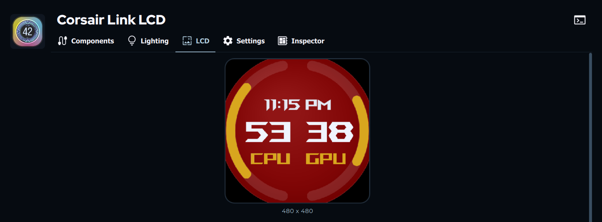
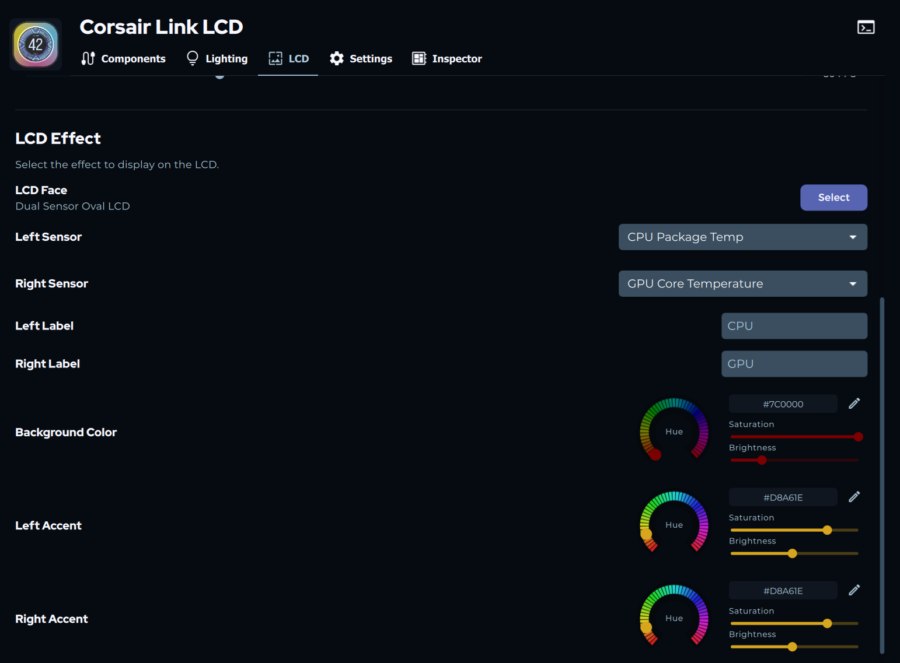

# Corsair LCD Style (SignalRGB LCDFace)

Custom SignalRGB LCD face focused on dual temperature gauges with a Corsair-style circular layout.

## Files

- `Corsair LCD Style.html` - main LCDFace file

## Features

- Dual sensor selection (`Left Sensor`, `Right Sensor`)
- Left/right label text fields (`CPU`, `GPU`, etc.)
- Custom colors:
  - `Background Color`
  - `Left Accent`
  - `Right Accent`
- Live clock at top (`HH:MM AM/PM`)
- Dynamic text outlines for readability on dark or light backgrounds
- Temperature-only gauge scaling, hardcoded range:
  - Min: `15`
  - Max: `95`

## Install

1. Copy `Corsair LCD Style.html` to:
   - `C:\Users\<YourUser>\Documents\WhirlwindFX\LCDFaces\`
   - or if Documents is redirected to OneDrive:
   - `C:\Users\<YourUser>\OneDrive\Documents\WhirlwindFX\LCDFaces\`
2. Restart SignalRGB (or reselect the LCD face).
3. In SignalRGB LCD settings, choose **Corsair LCD Style**.

## Screenshots

### Example 1: LCD Preview In SignalRGB

This shows the actual LCD screen preview inside SignalRGB.

### Example 2: Sensor And Color Settings

This shows the face settings panel for color gradients and sensor selection.

## Usage Notes

- Pick temperature sensors in `Left Sensor` and `Right Sensor`.
- Bar sweep is normalized to `15-95` regardless of sensor-reported min/max.
- If a sensor read fails temporarily, last known value is retained to avoid flicker.

## Customization (Code)

In `Corsair LCD Style.html`:

- Layout scale: `LAYOUT_SCALE`
- Fixed temp range: `TEMP_MIN`, `TEMP_MAX`
- Arc behavior: `maxSweep`, `minSweep` inside `drawSideArc()`
- Text positioning: `textYOffset` inside `drawText()`

## Troubleshooting

- Face not showing:
  - Verify file is in `LCDFaces` folder and restart SignalRGB.
- Values not updating:
  - Recheck selected sensors in the face properties.
- Text hard to read:
  - Keep using `Background Color`; dynamic outlines auto-adjust contrast.
